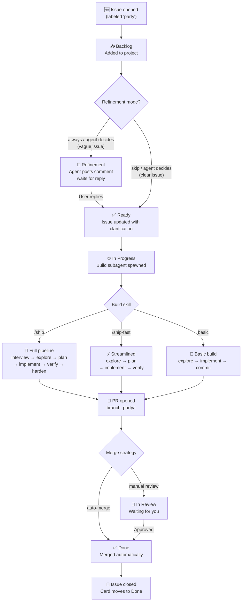

# 🎉 party.md

Use GitHub issues and projects as a kanban board to ship features 24/7 autonomously.

[](https://github.com/amajorai/party.md)
[](https://github.com/amajorai/party.md)
[](https://github.com/amajorai/party.md)
[](https://github.com/amajorai/party.md)
[](https://github.com/amajorai/party.md/issues)

> [!NOTE]
> These skills have been built and tested with **Claude Code**. Codex support is untested. If you try them on Codex, we'd love your help. [Open an issue](https://github.com/amajorai/party.md/issues) to share what works and what doesn't.

## Works great with

- 📦 **[ship.md](https://github.com/amajorai/ship.md)** as the build skill inside party.md for full quality-gated feature delivery: interview → explore → plan → implement → verify → edge cases → E2E → simplify → security review.
- 🪅 **[vibe.md](https://github.com/amajorai/vibe.md)** to provision your production server and deployment pipeline before enabling the board. party.md's setup phase will offer to run it for you.
- 🎬 **[replay.md](https://github.com/amajorai/replay.md)** to record video proof of features as they ship — paste the link in your PR for instant visual sign-off.
- ⚡ **[amajorai/skills](https://github.com/amajorai/skills)** for edge cases, E2E, payments, auth, SEO, icons, CI, observability, and 20+ more.

## Why

Most AI dev tools stop when you close your laptop. party.md doesn't. Run it on a server, a Pi, or GitHub Actions and use GitHub Projects as the interface. Your team files issues the normal way; the agent builds them. Nobody needs to touch Claude Code.

## Where to run party.md

| Environment | How | Best for |
|-------------|-----|----------|
| **Your laptop** | `/loop 5m /party` in a Claude Code terminal | Getting started, active dev sessions |
| **Cloud server / VPS** (Hetzner, OVH, AWS, DigitalOcean) | SSH in, install Claude Code + `gh`, run `/loop` in `tmux` | 24/7 unattended operation |
| **Raspberry Pi** | Same as VPS. Claude Code runs fine on arm64 | Low-cost always-on home server |
| **GitHub Actions** | party.md creates the workflow for you during setup | Serverless, event-driven, no machine to maintain |
| **Any CI/CD runner** | Trigger `/party --issue <N>` as a job step | Custom pipelines, self-hosted runners |

**Recommended path:**
1. Start locally with `/loop 5m /party` to test your setup
2. Once it's working, SSH into a server (or use [vibe.md](https://github.com/amajorai/vibe.md) to provision one), clone your repo, and run the loop there permanently
3. Optionally add GitHub Actions as a fallback for when the server is down

#### Setting up on a server or Pi

```bash
# 1. Install Claude Code
npm install -g @anthropic-ai/claude-code

# 2. Authenticate
claude auth login

# 3. Install GitHub CLI and authenticate
# Ubuntu/Debian:
sudo apt install gh
# macOS / others: https://cli.github.com/manual/installation
gh auth login

# 4. Clone your project repo
git clone https://github.com/your-org/your-repo.git
cd your-repo

# 5. Install party.md
npx skills add amajorai/party.md

# 6. Run setup (first time only)
claude "/party --setup"

# 7. Start the board loop in a persistent session
tmux new -s party
claude "/loop 5m /party"
# Detach: Ctrl+B then D
# The loop keeps running after you close SSH
```

To reconnect later: `tmux attach -t party`

## Skills

| Skill | What it does |
|--------------------------------|-------------|
| [`/party`](skills/party/SKILL.md) | First run: sets up your GitHub Project kanban board, configures build skill, merge strategy, and refinement mode. Every run after: scans for new issues, refines vague ones via comments, spawns parallel build agents, tracks PRs, and moves cards automatically. |

## How it works



## Quickstart

```bash
npx skills add amajorai/party.md
```

Then in any repo:

```
/party
```

First run walks you through setup. Takes about 2 minutes. After that, keep your GitHub Project open in a browser tab and watch the board fill itself in.

#### Setup interview

On first run (or when you pass `--setup`), party.md asks five questions via interactive prompts — one at a time, waiting for each answer before continuing:

| # | Question | Options |
|---|----------|---------|
| 1 | **How should the board agent run?** | Local loop (`/loop 5m /party`) · GitHub Actions · Both |
| 2 | **Which skill should build features?** | `/ship` (full pipeline) · `/ship-fast` (streamlined, recommended) · Basic build |
| 3 | **How should built code be merged?** | PR, you review (recommended) · PR, auto-merge · Direct commit to main |
| 4 | **When should the agent ask clarifying questions?** | Agent decides (recommended) · Always · Skip |
| 5 | **Run vibe.md setup first?** | Yes · No |

After answering, party.md creates the GitHub Project, configures the six board columns, creates the required labels, optionally sets up the GitHub Actions workflow, and writes `.party.config.json`.

### Run modes

**Local loop** (start here):
```
/loop 5m /party
```
Runs every 5 minutes in your terminal. Uses your local Claude Code credit pool. Stop it any time with `Ctrl+C`.

**GitHub Actions** (24/7, no terminal needed):

During setup, choose "GitHub Actions" and party.md creates `.github/workflows/party.yml` for you. Add `ANTHROPIC_API_KEY` to your repo secrets and it runs automatically whenever you open or label an issue.

**Both** combines the local loop for active sessions with Actions as a fallback for when your terminal is closed.

### Auto-Update

Pass `--update` to get the latest version before running:
```
/party --update
```

Or set `SKILLS_AUTO_UPDATE: true` in your project CLAUDE.md to always auto-update.

### Claude Code plugin

```
/plugin marketplace add amajorai/party.md
/plugin install partymd@amajorai
```

Invoke as `/partymd:party`.

## Board columns

| Column | Meaning |
|--------|---------|
| **Backlog** | New issues land here. Agent picks them up on the next tick. |
| **Ready** | Requirements are clear. Agent will build on the next tick. |
| **In Progress** | A build subagent is working on this. |
| **In Review** | PR is open, waiting for review or auto-merging. |
| **Done** | Merged and closed. |
| **Blocked** | Issue is stuck. Agent won't touch it until you move it. |

## Labels

| Label | Meaning |
|-------|---------|
| `party` | Tells party.md to track this issue |
| `awaiting-clarification` | Agent posted a question; waiting for your reply |
| `building` | A build subagent is actively working |
| `blocked` | Issue is blocked (manual) |

## Star History

<a href="https://www.star-history.com/#amajorai/party.md&Date">
 <picture>
   <source media="(prefers-color-scheme: dark)" srcset="https://api.star-history.com/svg?repos=amajorai/party.md&type=Date&theme=dark" />
   <source media="(prefers-color-scheme: light)" srcset="https://api.star-history.com/svg?repos=amajorai/party.md&type=Date" />
   
 </picture>
</a>

